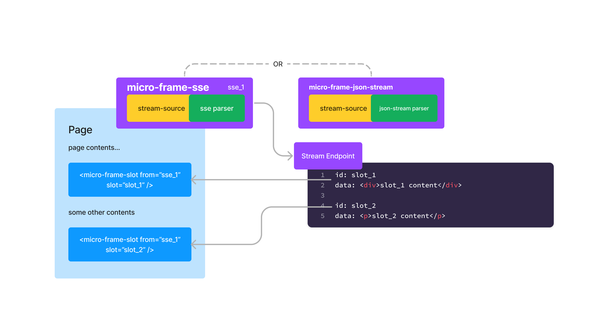

<h1 align="center">
  <!-- Logo -->
  <br/>
  micro-frame-sse & micro-frame-slot
	<br/>
</h1>

<p align="center">
  SSE stream support for micro-frame
</p>

# Installation

```console
npm install @micro-frame/marko
```

# How it works

Similar to `<micro-frame>`, the package exposes `<micro-frame-sse>` and `<micro-frame-slot>` tags in order to initiate SSE stream and placement of streaming content.

It works the same way as [micro-frame](../../../README.md) when used in browser vs in node server.

## Why

In addition to the benefits from [micro-frame](../../../README.md), `<micro-frame-sse>` allows short living server-sent event to steam content into designated slots within single http request. In another word, `micro-frame-sse` enables multiplexing of `micro-frame`.

Considering SSE is only one kind of streaming formats, `micro-frame` could potentially support all kinds of streaming formats like `json-stream` with a proper `parser`.



# Example

`micro-frame-sse` tag is required to put into earlier stage of page rendering (mainly at beginning of the page), who will initiate the SSE request as soon as page starts. `micro-frame-slot` is where content being injected and can be placed at any desired location.

```marko
<micro-frame-sse src="sse-source" name="unique_name" />

<micro-frame-slot from="unique_name" slot="slot_1">
  <@loading>
    Loading...
  </@loading>
  <@catch|err|>
      Uh-oh! ${err.message || err}
  </@catch>
</micro-frame-slot>
<div>
content in between
</div>
<ul>
  <li>
    <micro-frame-slot from="unique_name" slot="slot_2" />
  </li>
</ul>
```

# `<micro-frame-sse>` API

## (required) `src`

A path to SSE endpoint.

```marko
<micro-frame-sse src="sse-source" name="..." />
```

## (required) `name`

A unique name for the stream which matches slot's [from](#required-from). A page can have multiple streams.

```marko
<micro-frame-sse src="..." name="stream_name" />
```

## `read`

A function to parse the event which returns slot ID and streamed content as an array (optionally an isDone flag). The input is `MessageEvent`, please refer to [MessageEvent](https://developer.mozilla.org/en-US/docs/Web/API/EventSource/message_event#event_properties) for details. Return `undefined` will force this event to be skipped.

```typescript
function read(ev: MessageEvent) {
  if (ev.lastEventId === "someId") {
    // event with id: someId will be skipped
    return;
  }
  return [ev.lastEventId, ev.data, true];
}
```

Note that isDone flag is important when progressive rendering is in-order, because unfinished slot will block content streaming below the tag.

By default, below logic will be used if no `read` provided in the attribute:

```typescript
// default logic if read not provided
function read(ev: MessageEvent) {
  return [ev.lastEventId, ev.data, true];
}
```

```marko
<micro-frame-sse src="..." name="..." read(ev) {
  // logic to fetch slot ID and html_content from event
  return [slot, html_content];

  // if the isDone flag is set to true, slot will be closed after reading.
  // const isDone = true;
  // return [slot, html_content, isDone];
} />
```

## `headers`

Optionally provide additional http headers to send. Only the object form shown below is supported.

```marko
<micro-frame-sse src="..." name="..." headers={
  "X-My-Header": "Hello",
  "X-Another-Header": "World"
}/>
```

> Note that be default on the server side headers are copied from the current incoming request, the `headers` option will be merged with existing headers.

## `fetch`

Optionally provide function to override default `fetch` logic.

```marko
<micro-frame-sse src="..." name="..." fetch(...args) {
  return new Promise(resolve => {
    resolve({
      ok: true,
      body: new Readable({read() {}}).push('my own fetch logic (node server)').push(null)
    })
    // more basic usage:
    // const response = myOwnFetch(...args);
    // resolve(response);
  })
}  />
```

## `cache`

Mirrors the [`Request.cache` options](https://developer.mozilla.org/en-US/docs/Web/API/Request/cache) (works on both server and client renders).

```marko
<!--
This example will always show cached content if available
and fallback to the network otherwise
-->
<micro-frame-sse src="..." name="..." cache="force-cache"/>
```

## `timeout`

A timeout in `ms` (defaults to 30s) that will prematurely abort the request. This will trigger the `<@catch>` if provided.
If set to `0` the request will not time out.

```marko
<!--
This example will disable the default 30s timeout.
-->
<micro-frame-sse src="..." name="..." timeout=0/>
```

# `<micro-frame-slot>` API

## (required) `slot`

Unique ID for the slot which is used to receive streaming content from the SSE.

```marko
<micro-frame-slot from="..." slot="slot_id" />
```

## (required) `from`

Stream source name matching [name](#required-name) attribute of `<micro-frame-sse>`.

```marko
<micro-frame-slot from="stream-source-name" slot="..." />
```

## `client-reorder`

Flag indicate if the slot need to be streamed out-of-order. Please refer to [client-reorder](https://markojs.com/docs/core-tags/#await) in `<await>` tag.

```marko
<micro-frame-slot from="..." slot="..." client-reorder />
```

### `client-reorder="after-first-chunk"`

There is an additional value supported here which is `after-first-chunk`. When set, the slot will be rendered in-order before first chunk and will convert to out-of-order while streaming. This is useful when loading indicator is controlled inside stream.

```marko
<micro-frame-slot from="..." slot="..." client-reorder="after-first-chunk" />
```

## `timeout` in slot

A timeout in `ms` (defaults to 30s) that will prematurely abort the slot. This will trigger the `<@catch>` if provided.
If set to `0` the request will not time out.

```marko
<micro-frame-slot src="..." name="..." timeout=0/>
```

## `<@catch|err|>`

An [attribute tag](https://markojs.com/docs/syntax/#attribute-tag) rendered when there is a network error or timeout.
Error happens in `<micro-frame-sse>` will be emitted to `<micro-frame-slot>` which can be catched here.
If there is no `@catch` handler the error will be emitted to the stream, similar to the [`<await>`](https://markojs.com/docs/core-tags/#await) tag.

```marko
<micro-frame-slot from="..." slot="...">
  <@catch|err|>
    error: ${err.message}
  </@catch>
</micro-frame-slot>
```

## `<@loading>`

An [attribute tag](https://markojs.com/docs/syntax/#attribute-tag) rendered when while the request is still being streamed.
It is removed after the request has either errored, or successfully loaded.

```marko
<micro-frame-slot from="..." slot="...">
  <@loading>
    We are loading the nested app...
    <my-spinner/>
  </@loading>
</micro-frame-slot>
```

## `class`

Optional `class` attribute which works the same way as [Marko class attribute](https://markojs.com/docs/syntax/#class-attribute).

```marko
<micro-frame-slot from="..." slot="..." class="a c"/>
<micro-frame-slot from="..." slot="..." class={ a:true, b:false, c:true }/>
<micro-frame-slot from="..." slot="..." class=["a", null, { c:true }]/>
```

## `style`

Optional `style` attribute which works the same way as [Marko style attribute](https://markojs.com/docs/syntax/#style-attribute).

```marko
<micro-frame-slot from="..." slot="..." style="display:block;margin-right:16px"/>
<micro-frame-slot from="..." slot="..." style={ display: "block", color: false, marginRight: 16 }/>
<micro-frame-slot from="..." slot="..." style=["display:block", null, { marginRight: 16 }]/>
```

# Communicating between host and child

Communicating between host and child works the same way as [micro-frame](../../../README.md).

# Code of Conduct

This project adheres to the [eBay Code of Conduct](./.github/CODE_OF_CONDUCT.md). By participating in this project you agree to abide by its terms.
